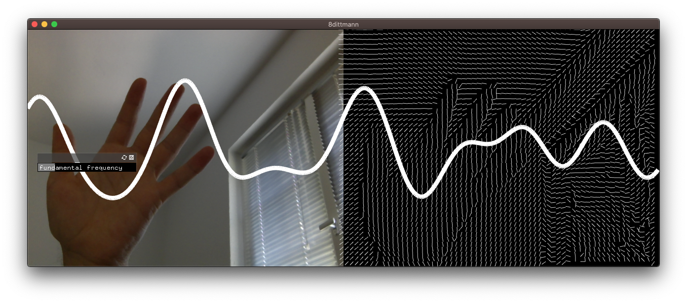

<!-- ---  
title: Creative Coding II
author: Angela Brennecke
affiliation: Film University Babelsberg KONRAD WOLF
date: Summer term 20
---   -->

Prof. Angela Brennecke, Creative Technologies, 03/2020  
Contributors:  Markus Traber, BSc, CTech Master 

---

# Interactive Visual Audio (iva)

In this repository we will pursue research ideas on 

- How to visually interpret sound
- How to interact with the visuals / sound sources
- How to sonify interactive visuals in a musically meaningful way

## Inspriation

- [Zach Lieberman's movement studies 1](https://www.instagram.com/p/B-HP2juDryV/?utm_source=ig_web_copy_link)
- [Zach Lieberman's movement studies 2](https://www.instagram.com/p/B-HP2juDryV/?utm_source=ig_web_copy_link)
- [Zach Lieberman's movement studies 3](https://www.instagram.com/p/B-DGofHjWLK/?utm_source=ig_web_copy_link)
- [Choreographiccoding](http://www.choreographiccoding.org/#lab-mz-19)

## How to contribute
Please refer to the instructions in our [wiki](https://github.com/ctechfilmuniversity/research_iva/wiki#how-to-contribute-code).

## How to use
Use the number keys to switch between apps. Further instructions for each instrument is available on execution.

## Instruments

### 1 Brennecke
This instrument visualizes a sine oscillator. By pressing 'f' and moving the mouse in the y-direction, the frequency can be adapted.

### 2 Clausen
This instrument visualizes records 512 1px-columns via the webcam with a slitscan approach. When the recording is finished, the pixel values are being converted to greyscale. Then the recorded pixel values of each pixel column are made audible by mapping the pixel values to fequencies. 

### 3 Traber
This instrument also utilizes the webcam and the slitscan approach. The pixel column is divided into 6 zones, which each represent a pitch. The instrument calculates the bightness of each zone and plays back the according pitch of the currently brightest zone.

### 4 Stimberg
This instrument utilizes the webcam and analyzes the optical flow. Diferent musical tones are assigned to the diferent directions, whose amplitude is determined by the strength of the change in movement which, in turn, is determined by the number of vectors.

### 5 Dittmann
Description missing on how sound is generated. The visualization on the right side divides the webcam image into pixel squares. The brightness of each square is being mapped to the rotation of the line, that is being drawn instead.

### 6 Object contours
Based on an ofxOpenCV example this instruments recognizes contours of objects in front of the webcam. It has different modes to generate sound, where area and y-position of a contour can have an influence on the sound generation.
